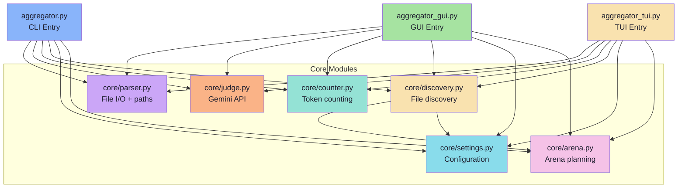
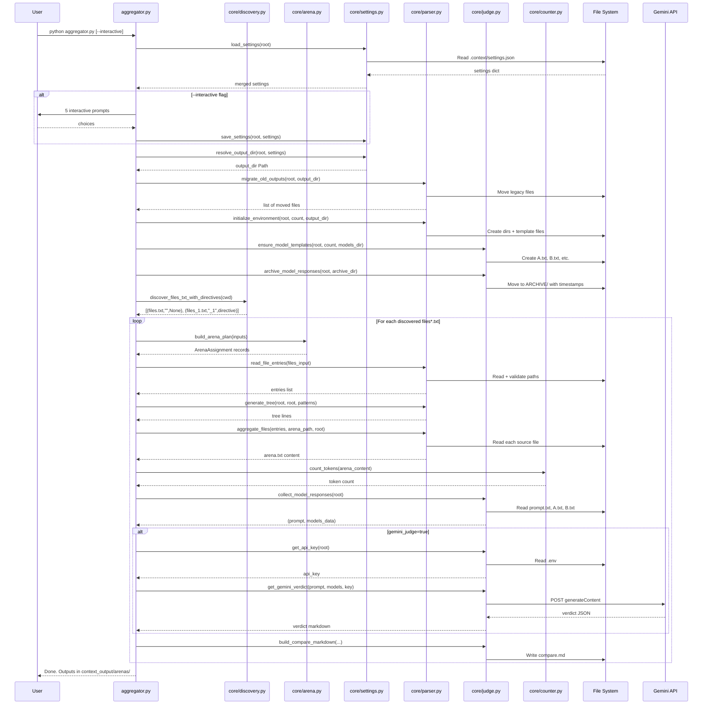
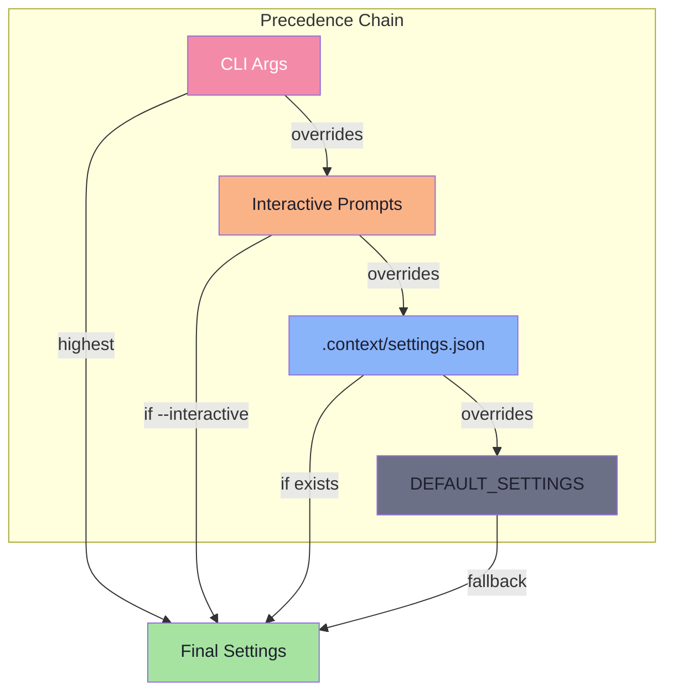
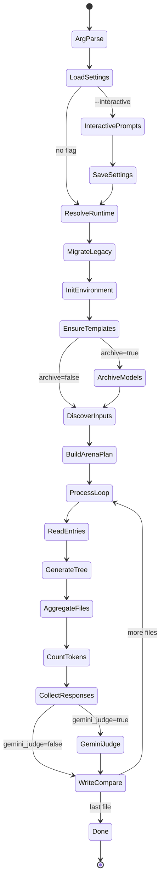
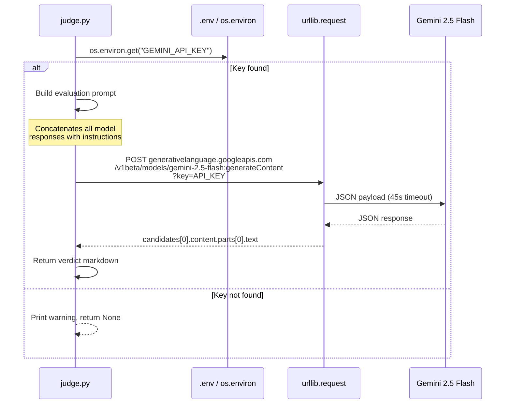

# Visualization Prompt — Context Tool Full Repo Visual Conversion

Use this prompt with any AI tool (Claude, GPT, Gemini, v0, bolt.new, etc.) to generate a complete visual representation of the **Context** project.

---

## The Prompt

```
You are a senior software architect and visualization engineer. Your task is to convert a Python CLI/TUI/GUI tool called "Context" (arena-context) into a comprehensive set of interactive visual diagrams and a live dashboard. Use Mermaid for diagrams, HTML/CSS/JS for the dashboard, and SVG for detailed architecture views.

## PROJECT OVERVIEW

Context is a Python tool that aggregates source files for LMArena blind pairwise AI comparisons. It has three interfaces (CLI, TUI, GUI) sharing a common core engine. The tool reads file manifests, generates aggregated code contexts, project trees, and compares AI model responses using a Gemini AI Judge. It supports multi-arena workflows with per-arena input files, numbered arena directories, and an ignore-pattern system.

## WHAT TO VISUALIZE

### 1. ARCHITECTURE DIAGRAM (Mermaid + SVG)

Generate a layered architecture diagram showing:

```
┌───────────────────────────────────────────────────────────┐
│                        FRONTENDS                          │
│  ┌──────────┐  ┌──────────┐  ┌──────────────────────────┐│
│  │ aggregator│  │aggregator│  │     aggregator_gui.py    ││
│  │    .py    │  │  _tui.py │  │     (Tkinter GUI)        ││
│  │  (CLI)    │  │  (TUI)   │  │     1272 lines           ││
│  │ argparse  │  │ Textual  │  │                          ││
│  └─────┬─────┘  └────┬─────┘  └──────────┬───────────────┘│
│        │              │                    │                │
├────────┼──────────────┼────────────────────┼───────────────┤
│        ▼              ▼                    ▼                │
│                CORE ENGINE (core/)                         │
│  ┌──────────┐  ┌──────────┐  ┌────────────────────────┐  │
│  │ parser.py │  │ judge.py │  │      counter.py        │  │
│  │1071 lines │  │ 615 lines│  │       52 lines         │  │
│  │           │  │          │  │                        │  │
│  │• file I/O │  │• Gemini  │  │• tiktoken              │  │
│  │• paths    │  │• REST API│  │• fallback              │  │
│  │• tree gen │  │• compare │  │• cl100k_base           │  │
│  │• migrate  │  │• archive │  │                        │  │
│  └──────────┘  └──────────┘  └────────────────────────┘  │
│  ┌──────────┐  ┌──────────┐  ┌────────────────────────┐  │
│  │arena.py  │  │settings  │  │    discovery.py        │  │
│  │272 lines │  │  .py     │  │    382 lines           │  │
│  │          │  │536 lines │  │                        │  │
│  │• arenas  │  │• config  │  │• file discovery        │  │
│  │• dirs    │  │• defaults│  │• ignore patterns       │  │
│  │• plan    │  │• migrate │  │• arena snapshots       │  │
│  │          │  │• legacy  │  │• structural rule       │  │
│  │          │  │  files   │  │                        │  │
│  └──────────┘  └──────────┘  └────────────────────────┘  │
└───────────────────────────────────────────────────────────┘
```

Show:
- Three frontend modules at the top (CLI, TUI, GUI)
- Six core modules at the bottom (parser, judge, counter, arena, settings, discovery)
- Arrows showing dependency direction (frontends → core, never core → frontend)
- discovery.py is the only cross-importing module (imports arena + settings)
- Line counts and key responsibilities annotated on each box

### 2. MODULE DEPENDENCY GRAPH (Mermaid)

Generate a detailed import graph:



Color coding:
- Blue (#89b4fa) = CLI
- Green (#a6e3a1) = GUI
- Yellow (#f9e2af) = TUI
- Mauve (#cba6f7) = parser
- Orange (#fab387) = judge
- Teal (#94e2d5) = counter
- Pink (#f5c2e7) = arena
- Sky (#89dceb) = settings
- Yellow (#f9e2af) = discovery

### 3. DATA FLOW DIAGRAM (Mermaid sequence diagram)

Generate a sequence diagram for the complete CLI lifecycle:



### 4. FILE STRUCTURE VISUALIZATION (Interactive Tree)

Create an interactive collapsible tree of the project:

```
context/
├── .context/                    # Tool configuration
│   ├── settings.json           # Persistent preferences (JSON)
│   └── ignore                  # User ignore patterns
├── .env                        # Gemini API key (gitignored)
├── .env.example                # API key template
├── core/                       # Core engine (6 modules)
│   ├── __init__.py             # Package marker (7 lines)
│   ├── parser.py               # File I/O, paths, tree, migration (955 lines)
│   ├── judge.py                # Gemini API, compare, archive (615 lines)
│   ├── counter.py              # Token counting (52 lines)
│   ├── arena.py                # Arena directive parsing, planning (272 lines)
│   ├── settings.py             # Configuration, defaults, paste-attachments (512 lines)
│   └── discovery.py            # File discovery, ignore patterns (312 lines)
├── aggregator.py               # CLI entry point, argparse, orchestration
├── aggregator_gui.py           # Tkinter GUI (1195 lines)
├── aggregator_tui.py           # Textual TUI (513 lines)
├── install.py                  # Dependency installer (15 lines)
├── renumber_arenas.py          # Arena renumbering utility (257 lines)
├── gui/                        # Extension projects
│   ├── browser-extension/      # Browser extension
│   └── vscode-extension/       # VS Code extension
├── skills/                     # Agent skills
│   └── migrate-to-flat-layout/ # Flat-layout migration skill
├── prompt.txt                  # Requirements specification (214 lines)
├── features.md                 # Feature documentation (239 lines)
├── README.md                   # Usage guide (113 lines)
├── requirements.txt            # Python dependencies
├── files.txt                   # Current input manifest
├── context_output/             # Generated outputs
│   ├── arenas/                 # Per-arena output directories
│   │   ├── 001-<name>/        # Arena 001 with its own files
│   │   │   ├── arena.md       # Arena header
│   │   │   ├── context.md     # Aggregated source code
│   │   │   ├── structure.txt  # Project tree snapshot
│   │   │   ├── compare.txt    # Model comparison
│   │   │   ├── prompt.txt     # Arena prompt
│   │   │   ├── A.txt          # Model A response
│   │   │   ├── B.txt          # Model B response
│   │   │   └── ARCHIVE/       # Archived model responses
│   │   ├── 002-<name>/
│   │   └── ...
│   ├── models/                 # Global model response storage
│   │   ├── A/
│   │   ├── B/
│   │   ├── prompt/
│   │   └── ARCHIVE/
│   └── structure/              # Global structure output
│       └── structure.txt
├── temp/                       # Temporary files
└── venv/                       # Python virtual environment
```

Make each node clickable to show file details (line count, imports, functions).

### 5. GUI WIREFRAME (HTML/CSS)

Generate a pixel-accurate wireframe of the Tkinter GUI based on these specs:

**Window:** 1100x750px, dark theme (Catppuccin Mocha)

**Color Palette:**
- Background: #1e1e2e
- Panel: #181825
- Entry: #313244
- Hover: #45475a
- Text: #cdd6f4
- Dim text: #6c7086
- Accent (blue): #89b4fa
- Green: #a6e3a1
- Yellow: #f9e2af
- Orange: #fab387
- Red: #f38ba8
- Mauve: #cba6f7
- Teal: #94e2d5

**Layout:**
```
┌──────────────────────────────────────────────────────┐
│  HEADER: "Context — File Aggregator"                  │
├────────────────────┬─────────────────────────────────┤
│ LEFT PANEL (40%)   │ RIGHT PANEL (60%)                │
│ ┌────────────────┐ │ ┌──────────────────────────────┐│
│ │ Search bar     │ │ │ QUEUE PANE (top-left 50%)     ││
│ ├────────────────┤ │ │ Selected files list            ││
│ │ File tree      │ │ │ [file1.py] [file2.ts]         ││
│ │ ├─ src/        │ │ │ [+ Add] [- Remove] [Clear]    ││
│ │ │  ├─ comp/    │ │ ├──────────────────────────────┤│
│ │ │  └─ lib/     │ │ │ OPTIONS PANE (top-right 50%)  ││
│ │ └─ tests/      │ │ │ ☐ Gemini Judge                ││
│ │                │ │ │ ☐ Compact Mode                 ││
│ │ [Add Selected] │ │ │ Model Count: [2▼]             ││
│ └────────────────┘ │ │ Format: [md▼]                 ││
│                    │ │ Output: [context_output___]    ││
│                    │ ├──────────────────────────────┤│
│                    │ │ LOG PANE (bottom 50%)          ││
│                    │ │ > Aggregating... 1234 tokens  ││
│                    │ │ > Done. 3 files processed.     ││
│                    │ └──────────────────────────────┘│
├────────────────────┴─────────────────────────────────┤
│ STATUSBAR: [Root: C:/proj] [Token: 1234] [▶ Run]    │
└──────────────────────────────────────────────────────┘
```

### 6. TUI WIREFRAME (Terminal aesthetic)

Show the Textual TUI layout:

```
┌─ Context — TUI ─────────────────────────────────────┐
│ Root: C:/programming/Python/Projects/context         │
│ [path input field                        ] [Set Root]│
├────────────────────┬────────────────────────────────┤
│ FILE TREE (40%)    │ QUEUE (50% height)              │
│ ▼ src/             │ ☑ src/main.py                   │
│   ▼ components/    │ ☑ src/utils.ts                  │
│     Navbar.tsx     │ ☐ src/types.d.ts                │
│     Footer.tsx     │ ☐ tests/test.py                 │
│   lib/             │                                 │
│     auth.ts        │ [Add] [Remove] [Clear]          │
│ ▼ tests/           ├────────────────────────────────┤
│   test.py          │ LOG (50% height)                │
│                    │ [info] Loaded 3 files            │
│ TOKENS: ~2,450     │ [info] Arena written (45KB)     │
│                    │ [warn] Gemini key not set        │
├────────────────────┴────────────────────────────────┤
│ [r]efresh [a]ggregate [c]lear [q]uit                │
└────────────────────────────────────────────────────┘
```

### 7. SETTINGS FLOW DIAGRAM (Mermaid flowchart)

Show the configuration resolution precedence:



### 8. LIFECYCLE STATE MACHINE (Mermaid state diagram)

Show the tool's run states:



### 9. API INTEGRATION DIAGRAM

Show the Gemini API call flow:



### 10. INTERACTIVE DASHBOARD (HTML + JS)

Build a single-page HTML dashboard with these tabs:

**Tab 1: Overview**
- Project name, description, author
- Total lines of code (~6,066 across all source files)
- Total functions + methods
- Total classes
- External APIs (1: Gemini)
- Dependencies: tiktoken (optional), textual (optional), tkinter (stdlib)

**Tab 2: Architecture**
- Embedded Mermaid diagrams (dependency graph, data flow)
- Clickable module cards showing file details

**Tab 3: Code Map**
- Collapsible file tree
- Click any file to see: line count, all function names with line numbers, imports, global constants
- Search across all functions

**Tab 4: Scenarios**
- Animated step-by-step walkthroughs of each scenario:
  - First run (auto-create everything)
  - Normal run (silent, settings exist)
  - Interactive run (prompts)
  - Multi-file run
  - Archive flow
  - Custom output directory
  - Notes auto-merge
  - Compact mode
  - No model files exist
  - Arena directive parsing
  - Arena renumbering

**Tab 5: Data Flow**
- Interactive diagram showing: Input → Discover → Plan Arena → Parse → Transform → Output
- Hover over each step to see what happens
- Show file contents at each stage (files.txt → entries → arena.txt → compare.md)

**Tab 6: Settings**
- Visual representation of settings.json
- Show precedence chain (CLI > Interactive > Settings > Defaults)
- Editable form that shows how changes affect behavior

### 11. FUNCTION INDEX (Searchable Table)

Generate a searchable/filterable table of ALL functions across ALL files:

| Module | Function | Lines | Parameters | Returns | Called By |
|--------|----------|-------|------------|---------|-----------|
| parser.py | find_project_root | ... | path: Path | Path \| None | aggregator, gui, tui |
| parser.py | load_settings | ... | root: Path | dict | aggregator, gui |
| arena.py | parse_arena_directive | ... | first_line: str | ArenaDirective \| None | discovery |
| arena.py | build_arena_plan | ... | inputs: set | list[ArenaAssignment] | aggregator |
| settings.py | load_settings | ... | root: Path | dict | aggregator, gui, tui |
| discovery.py | discover_files_txt | ... | cwd: Path | list[tuple] | aggregator |
| discovery.py | get_latest_state | ... | root: Path | dict | aggregator |
| ... | ... | ... | ... | ... | ... |

### 12. GIT HISTORY TIMELINE (Visual)

Show the project evolution as a visual timeline:

```
Jun 22 ──●── feat: define prompt specifications
         │
Jun 22 ──●── feat: implement project configuration structure
         │
Jun 23 ──●── feat: modularize core logic, settings system
         │
Jun 23 ──●── chore: ignore log files
         │
Jun 23 ──●── Delete log files (×4)
         │
Jun 23 ──●── refactor: improve GUI layout
         │
Jun 23 ──●── feat: Gemini AI judge integration
         │
Jun 23 ──●── feat: flat-layout refactor, arena directive system
         │
Jun 24 ──●── feat: core/arena.py, core/discovery.py, core/settings.py
         │
Jun 25 ──●── feat: per-arena output directories, numbered arenas
         │
Jun 26 ──●── feat: renumber_arenas.py utility, arena renumbering
         │
Jun 27 ──●── feat: ignore pattern system (.context/ignore)
         │
Jun 28 ──●── feat: paste-attachments archival, settings improvements
         │
Current ──●── prompt.txt updates, features.md, VISUALIZATION_PROMPT.md
```

## DESIGN REQUIREMENTS

1. **Color scheme:** Use Catppuccin Mocha palette throughout
   - Base: #1e1e2e, Mantle: #181825, Surface0: #313244
   - Text: #cdd6f4, Overlay0: #6c7086
   - Blue: #89b4fa, Green: #a6e3a1, Yellow: #f9e2af
   - Orange: #fab387, Red: #f38ba8, Mauve: #cba6f7, Teal: #94e2d5

2. **Typography:** Use "JetBrains Mono" for code, "Inter" for UI text

3. **Responsive:** Dashboard should work on 1280px+ screens

4. **Interactive:** All diagrams should be zoomable, collapsible, and searchable

5. **Export:** Allow exporting diagrams as PNG/SVG and the dashboard as a standalone HTML file

6. **Dark mode only** — match the tool's aesthetic

## DELIVERABLES

1. A single `dashboard.html` file (self-contained, all CSS/JS inline)
2. Mermaid `.md` files for each diagram (copy-pasteable into GitHub/GitLab)
3. SVG exports of the architecture diagrams
4. A `VISUAL_MAP.md` file linking to all visualizations

## TECHNICAL NOTES

- The tool has ZERO required third-party dependencies for CLI (pure stdlib)
- Only optional: tiktoken (token counting), textual (TUI)
- GUI uses tkinter (always available)
- API calls use urllib.request (no requests library)
- Settings auto-created on first run
- Legacy migration is one-time only
- All three frontends share the same core/ engine
- discovery.py is the only cross-importing core module (imports arena + settings)
- Error handling is fail-soft everywhere (never crashes)
- The .env file contains a real API key (GEMINI_API_KEY) — do not expose it
- Arena outputs use per-arena directories under context_output/arenas/<NNN>-<name>/
```

---

## How to Use This Prompt

1. **For architecture diagrams:** Copy the Mermaid sections into any Mermaid renderer (mermaid.live, GitHub, Notion)
2. **For the dashboard:** Give the full prompt to Claude/GPT and ask for `dashboard.html`
3. **For wireframes:** Use the GUI/TUI wireframe specs with v0.dev or bolt.new
4. **For documentation:** The function index table can be pasted into docs
5. **For presentations:** The sequence diagrams work in slides

## File Inventory

| File | Lines | Size | Purpose |
|------|-------|------|---------|
| core/parser.py | 955 | 41.1KB | Foundation: file I/O, paths, tree, migration |
| core/judge.py | 615 | 26.2KB | Gemini API, compare generation, archiving |
| core/settings.py | 512 | 20.7KB | Configuration, defaults, paste-attachments |
| core/discovery.py | 312 | 14.4KB | File discovery, ignore patterns, arena snapshots |
| core/arena.py | 272 | 11.9KB | Arena directive parsing, arena planning |
| core/counter.py | 52 | 2KB | Token counting (tiktoken + fallback) |
| core/__init__.py | 7 | 0.2KB | Package marker, re-exports |
| aggregator.py | 706 | 29KB | CLI entry point, argparse, orchestration |
| aggregator_gui.py | 1195 | 62KB | Tkinter desktop GUI |
| aggregator_tui.py | 513 | 19KB | Textual terminal UI |
| install.py | 15 | 0.6KB | Dependency installer |
| renumber_arenas.py | 257 | 10.4KB | Arena renumbering utility |
| prompt.txt | 214 | 16.2KB | Requirements specification |
| features.md | 239 | 10KB | Feature documentation |
| README.md | 113 | 11.5KB | Usage guide |
| **TOTAL** | **~6,066** | **~265KB** | |
