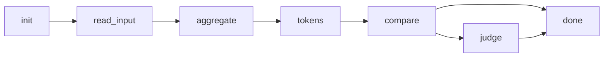

# Context Tool — Logical Disconnects Report

**Audit Date:** July 10, 2026
**Scope:** CLI (`aggregator.py`), Core (`core/pipeline.py`, `core/settings.py`), GUI Server (`gui/server/main.py`), Browser Extension (`gui/browser-extension/`), Decomposed GUI (`gui/`)
**Reviewers:** 10 parallel subagents (explore type)
**Mode:** Strict logic and workflow audit — read-only analysis, no edits

---

## Table of Contents

1. [CRITICAL (6 issues)](#critical)
2. [STRUCTURAL (8 issues)](#structural)
3. [UX FLAWS (5 issues)](#ux-flaws)

---

## <a name="critical"></a>CRITICAL (6 issues)

### C1 — `gui/app.py`: Settings item-assignment crash on `Settings` dataclass (entire `gui/` package is dead code)

| Property | Value |
|----------|-------|
| **Severity** | Critical |
| **Category** | Runtime crash — settings save silently fails |
| **Files** | `gui/app.py:181-191`, `aggregator_gui.py:364-374` |
| **Also** | `gui/app.py:98-99` (type annotation), `gui/app.py:150` (settings assignment) |

```python
# gui/app.py:181-191 (also aggregator_gui.py:364-374, near-identical)
def _save_current_settings(self, *args) -> None:
    if self._suppress_settings_save:
        return
    self._settings["gemini_judge"] = self._judge_var.get()          # ← TypeError
    self._settings["compact_mode"] = self._compact_var.get()        # ← TypeError
    self._settings["archive"] = self._archive_var.get()             # ← TypeError
    self._settings["output_dir"] = (
        self._output_dir_var.get().strip() or "context_output"      # ← TypeError
    )
    try:
        self._settings["model_count"] = int(self._model_count_var.get())  # ← TypeError
    except ValueError:
        self._settings["model_count"] = 2                           # ← TypeError
    self._settings["output_format"] = self._output_format_var.get() # ← TypeError
```

**Root Cause:** `self._settings` is assigned at `gui/app.py:150` via `load_settings()` which returns a `Settings` dataclass instance. The `Settings` class defines `__getitem__` (dict-style read at `core/settings.py:183-202`) and `get` (safe read with default at `core/settings.py:204-209`), but **no `__setitem__`**. The type annotation at `gui/app.py:98` (`self._settings: dict[str, object] = {}`) is misleading — at runtime it is a `Settings` object.

**Consequence:** Every dict-style write raises `TypeError: 'Settings' object does not support item assignment`. The crash fires inside a Tk `trace_add` callback (registered at `gui/app.py:131`), which Tkinter swallows silently. Settings changes are **lost with zero feedback** — no console error, no log message, no exception visible to the user.

**The save call after the crash:**
```python
# gui/app.py:192-195
try:
    save_settings(self._project_root, self._settings)
except OSError as exc:
    logger.warning("Could not save settings: %s", exc)
```
The save is wrapped in try/except, but the crash happens before it executes. The `try` block never runs.

---

#### Broader Discovery — The entire `gui/` package (10 files, ~2,400 lines) is unreachable dead code

| File | Lines | Status | Imported By |
|------|-------|--------|-------------|
| `gui/app.py` | 570 | Dead | **No entry point imports this** |
| `gui/scanner.py` | 242 | Dead | `gui/app.py` (dead) |
| `gui/queue_manager.py` | 191 | Dead | `gui/app.py` (dead) |
| `gui/builders.py` | 480 | Dead | `gui/app.py` (dead) |
| `gui/aggregation_runner.py` | 466 | Dead | `gui/app.py` (dead), `gui/api_key_dialog.py` (dead) |
| `gui/log_panel.py` | 123 | Dead | `gui/app.py` (dead), `gui/builders.py` (dead) |
| `gui/api_key_dialog.py` | 183 | Dead | `gui/app.py` (dead) |
| `gui/theme.py` | 80 | Dead | `gui/app.py` (dead), `gui/builders.py` (dead), `gui/log_panel.py` (dead), `gui/api_key_dialog.py` (dead) |
| `gui/paths.py` | 27 | Dead | `gui/app.py` (dead), `gui/scanner.py` (dead) |
| `gui/util.py` | 24 | Dead | `gui/aggregation_runner.py` (dead) |
| **Total** | **~2,400** | Dead | |

**The docstring claim at `gui/__init__.py:21-25`:**
> "`aggregator_gui.py` is now a 30-line glue module that forwards to `gui.app.run_gui`"

**This is false.** `aggregator_gui.py` is 1,513 lines of monolithic Tk code defining its own `AggregatorGUI` class. The refactoring into `gui/` was started but the entry point was never switched over. Every module in `gui/` forms a self-referencing import graph with no root in any `__main__` entry point.

---

### C2 — `aggregator.py`: `dict(settings)` crash with `--interactive`

| Property | Value |
|----------|-------|
| **Severity** | Critical |
| **Category** | Runtime crash — hard failure on a documented flag |
| **File** | `aggregator.py:458`, triggered at `aggregator.py:602` |

```python
# aggregator.py:458
resolved = dict(settings)
```

**Root Cause:** `settings` is a `Settings` dataclass instance. `dict(settings)` requires `keys()` and `__getitem__` or `__iter__`. The `Settings` dataclass defines `__getitem__` (`core/settings.py:183-202`) and `get` (`core/settings.py:204-209`) but **neither `keys()` nor `__iter__`**. Calling `dict()` on it raises `TypeError: 'Settings' object is not iterable`.

**Trigger path:**
```
aggregator.py:main()
  → args.interactive is True
  → aggregator.py:602: settings = _run_interactive_prompts(settings)
    → aggregator.py:458: resolved = dict(settings)   # ← CRASH
```

```python
# aggregator.py:600-611 (trigger site)
if args.interactive:
    settings = _run_interactive_prompts(settings)
    try:
        save_settings(init_root, settings)
    except OSError as exc:
        print(
            f"Warning: Could not save settings: {exc}",
            file=sys.stderr,
        )
```

**Condition:** Only triggers when the `--interactive` flag is passed. The non-interactive path never calls `dict(settings)`. This is a latent bug from the flat-to-nested dataclass refactoring — the `_run_interactive_prompts` function was converted to return a `Settings` dataclass, but its downstream consumer still expects a dict.

---

### C3 — `gui/server/main.py`: Global `DEFAULT_SETTINGS` mutation via shared reference leak

| Property | Value |
|----------|-------|
| **Severity** | Critical |
| **Category** | Data corruption — settings cross-contaminate across requests |
| **File** | `gui/server/main.py` |
| **Lines** | 112-124 (definition), 186-201 (`read_settings` error paths), 258-260 (`update_settings`) |

**The bug — three of four return paths skip `.copy()`:**

```python
# gui/server/main.py:172-204
def read_settings() -> tuple[dict[str, object], str | None]:
    # ...
    try:
        # ... reads and parses settings.json ...
        return data, None          # (not relevant — reads from file)
    except OSError as exc:
        msg = f"Could not read settings: {exc}"
        return DEFAULT_SETTINGS, msg       # LINE 192 — returns MODULE-LEVEL REFERENCE
    if not content.strip():
        return DEFAULT_SETTINGS, msg       # LINE 195 — returns MODULE-LEVEL REFERENCE
    except json.JSONDecodeError as exc:
        msg = f"Could not parse settings: {exc}"
        return DEFAULT_SETTINGS, msg       # LINE 201 — returns MODULE-LEVEL REFERENCE
    # Line 186 is the ONLY path that correctly copies:
    # return DEFAULT_SETTINGS.copy(), msg
```

**The exploit path:**

```python
# gui/server/main.py:258-260
@app.put("/api/settings")
async def update_settings(payload: SettingsUpdate, token: str = Depends(get_current_token)):
    current, _ = read_settings()            # ← could be module-level reference
    current.update(payload.model_dump(exclude_none=True))  # ← MUTATES global!
    write_settings(current)
```

**Progression of corruption:**

1. `settings.json` has a transient read error → `read_settings()` returns live `DEFAULT_SETTINGS` dict reference
2. User calls `PUT /api/settings` with `{"output_dir": "/tmp/test"}` → `current.update(...)` **permanently mutates** the module-level `DEFAULT_SETTINGS` dict
3. All subsequent `read_settings()` calls (even if `settings.json` is now valid) return the **corrupted dict merge** — the file content is merged into the polluted `data` variable, but the default fallback paths still use the corrupted dict

**Why it's illogical:** Line 186 correctly returns `DEFAULT_SETTINGS.copy()`. Lines 192, 195, and 201 return the **same object without copying**. This inconsistency means that under error conditions (file missing, empty, malformed), the global defaults become permanently corrupted. A single `PUT /api/settings` after an error permanently changes the baseline for all future requests.

---

### C4 — WebSocket `/ws/run/{run_id}` has zero authentication

| Property | Value |
|----------|-------|
| **Severity** | Critical |
| **Category** | Security — missing auth on real-time pipeline progress stream |
| **File** | `gui/server/ws.py:72-86` |

```python
# gui/server/ws.py:72-86 (complete endpoint — no auth)
@router.websocket("/ws/run/{run_id}")
async def websocket_endpoint(websocket: WebSocket, run_id: str):
    await manager.connect(websocket, run_id)
    try:
        while True:
            data = await websocket.receive_text()
            if data == "ping":
                await websocket.send_text("pong")
    except WebSocketDisconnect:
        manager.disconnect(run_id)
```

**Comparison with HTTP routes:**

| Endpoint | Auth Mechanism | Enforced? |
|----------|---------------|-----------|
| `GET /health` | None (intentionally public) | N/A |
| `POST /auth/pair` | None (pre-auth exchange) | N/A |
| All `GET/PUT/POST /api/*` | `Depends(get_current_token)` | Yes — Bearer token required |
| `WebSocket /ws/run/{run_id}` | **Nothing** | **No** |

**Why it's illogical:**
- The loopback middleware (`main.py:155-158`) uses `@app.middleware("http")` — this **explicitly does not apply** to WebSocket upgrades. FastAPI's HTTP middleware is not invoked during WebSocket handshake.
- Every HTTP route with auth requires a valid Bearer token. The WebSocket — which receives the **same `run_id`** that `POST /api/run` returns — streams pipeline progress including stage names, error messages, file paths, and timing data.
- An attacker on the same machine who can discover or guess a `run_id` (UUID v4, but no rate limiting, no account lockout) can eavesdrop on any active run.

---

### C5 — Four separate pipeline implementations (4x duplication)

| Property | Value |
|----------|-------|
| **Severity** | Critical |
| **Category** | Architecture — quadruplicated orchestration logic |
| **Files** | See table below |

| # | File | Entry Function | Lines | Progress Mechanism |
|---|------|---------------|-------|-------------------|
| 1 | `aggregator.py` | `_process_one()` | ~174 (lines 241-414) | `print()` to stdout |
| 2 | `aggregator_gui.py` | `_aggregate_worker()` | ~278 (lines 1127-1404) | Direct `_log_write()` to Tk widget |
| 3 | `core/pipeline.py` | `run_pipeline()` | ~332 (lines 242-574) | `ProgressCallback` → WebSocket bridge |
| 4 | `gui/aggregation_runner.py` | `run_aggregation()` | ~310 (lines 146-456) | `LogFn`/`StepFn`/`StatusFn`/`CancelFn` |

**All implement the same 6-phase sequence:**



**Subtle differences that produce divergent behavior:**

| Behavior | CLI (1) | Old GUI (2) | Pipeline (3) | New GUI (4) |
|----------|---------|-------------|--------------|-------------|
| Ignore patterns applied? | Yes — `load_ignore_patterns()` | Yes — `load_ignore_patterns()` | **No** | Yes — `load_ignore_patterns()` |
| Directive resolution | `build_arena_plan()` | `build_arena_plan()` | `next_arena_number()` only | `build_arena_plan()` |
| Pre-flight writability | `except OSError` at write time | `assert_writable()` before write | No check | No check |
| Gemini key missing behavior | Warning + skip | Dialog prompt | Soft-disable (sets `enabled=False`) | Dialog prompt |
| Error granularity | Per-file `Exception` | Per-file typed exceptions | Per-phase progress events + early return | Per-file typed exceptions |
| Partial failure | Continues to next input | Continues to next input | Returns early — single-input only | Continues to next input |
| Archive support | Inline in loop | Inline in loop | Not in pipeline | Not in runner |

**Why it's illogical:** Adding a new feature (e.g., "write JSON output format" or "generate token usage report") requires coordinated edits to **4 separate files** with different error handling conventions. The `core/pipeline.py` version is architecturally superior (callback-driven, decoupled from I/O, WebSocket-ready), but neither the CLI nor the old GUI can use it because they pre-date it.

---

### C6 — GUI server bypasses 7 critical CLI validation steps

| Property | Value |
|----------|-------|
| **Severity** | Critical |
| **Category** | Behavioral divergence — CLI and server produce different outputs |
| **Files** | `gui/server/main.py:608-682` vs `aggregator.py:472-843` |

**Every validation present in the CLI but absent in the GUI server:**

| # | Validation | CLI Location | Server Look-alike | Impact of Missing |
|---|-----------|-------------|-------------------|-------------------|
| 1 | `load_ignore_patterns()` — applies `.context/ignore` patterns to file list | `aggregator.py:674` | **None** | Server processes files CLI would ignore |
| 2 | `build_arena_plan()` — parses `# Target Arena:` directives, resolves conflicts via `on_arena_number_conflict` | `aggregator.py:725-751` | `next_arena_number()` (`main.py:560`) — simple sequential | Server ignores user's explicit arena directives |
| 3 | Structure drift detection — compares live `generate_tree()` against `structure.txt`, prompts user if changed | `aggregator.py:686-714` | **None** | No structure.txt update |
| 4 | Post-run directive report — prints shifted/stale/auto-numbered counts | `aggregator.py:790-827` | **None** | User has no feedback on directive resolution |
| 5 | `write_state_breadcrumb()` — writes `.context/state.json` with timestamp and arena count | `aggregator.py:834-841` | **None** | No state tracking for `--status` |
| 6 | `sync_paste_attachments()` — copies paste-attachment files into output | `aggregator.py:831` | **None** | Paste attachments never synced |
| 7 | Legacy migrations — `migrate_old_outputs()` + `migrate_to_per_file_folders()` + `migrate_to_flat_layout()` | `aggregator.py:626-634` | Separate `/api/run/check` endpoint (`main.py:468-497`) covers only old-file detection | Server assumes v3+ layout; legacy arenas silently excluded |

**Concrete example of divergence:**

A user has a `files.txt` with `# Target Arena: 005 my-benchmark`:

```
# Target Arena: 005 my-benchmark
src/main.py
src/utils.py
```

- **CLI:** Parses the directive, reads `settings.on_arena_number_conflict` (default: `"warn_and_shift"`), writes output to `<output_dir>/arenas/005-my-benchmark/`. If arena `005` already exists, shifts to `006` and warns.
- **Server:** Ignores the directive entirely. Calls `next_arena_number()` which computes `max(existing_numbers) + 1`. Writes output to `<output_dir>/arenas/042-my-benchmark/`. The directive's requested number is silently dropped.

**Same input, different output directory.** The extension user and CLI user get different results.

---

## <a name="structural"></a>STRUCTURAL (8 issues)

### S1 — Duplicate `DEFAULT_SETTINGS` in the server, missing 6 keys

| Property | Value |
|----------|-------|
| **Severity** | Structural |
| **Category** | Duplicated constants — drift risk |
| **File** | `gui/server/main.py:112-124` |

```python
# gui/server/main.py:112-124 — server's own copy of defaults
DEFAULT_SETTINGS: dict[str, object] = {
    "output_dir": "context_output",
    "output_format": "md",
    "model_count": 2,
    "gemini_judge": False,
    "compact_mode": False,
    "archive": False,
    "archive_dir": "ARCHIVE",
    "paste_attachments_enabled": False,
    "respect_target_arena_directive": True,
    "on_arena_number_conflict": "warn_and_shift",
    "use_default_ignore": True,
}
```

**Missing keys** (present in `core.settings._FLAT_TO_NESTED` at `core/settings.py:296-315`):

| Missing Key | Nested Path | Default Value |
|-------------|-------------|---------------|
| `paste_attachments_source_dir` | `paste_attachments.source_dir` | `"tmp/paste-attachments"` |
| `paste_attachments_target_subdir` | `paste_attachments.target_subdir` | `"tmp/paste-attachments"` |
| `paste_attachments_date_format` | `paste_attachments.date_format` | `"%Y-%m-%d"` |
| `paste_attachments_copy_mode` | `paste_attachments.copy_mode` | `"copy"` |
| `target_arena_directive_prefix` | `target_arena.directive_prefix` | `"# Target Arena:"` |
| `inputs_dir` | `inputs.dir` | `".context/inputs"` |

**Impact:** The server's `read_settings()` never returns these 6 keys. When the caller at line 520 does `_flat_dict_to_nested(flat_settings)`, the missing keys simply don't propagate — the nested dataclass defaults fill them in. This works **by accident** because the dataclass defaults match the missing values. But if a user explicitly sets one of these keys in `settings.json`, the server's `read_settings()` silenty drops it. The round-trip `read → modify → write` is lossy.

**Why it's illogical:** Instead of deriving defaults from `Settings()` (the single source of truth), the server hardcodes a **partial copy** that must be manually kept in sync. There is no test or lint rule enforcing this.

---

### S2 — No cleanup of partial output on pipeline failure

| Property | Value |
|----------|-------|
| **Severity** | Structural |
| **Category** | Reliability — partial/corrupt files left on disk |
| **Files** | All pipeline paths — see below |

| Path | Error Handler | Cleanup? |
|------|--------------|----------|
| `aggregator.py:784` | `except Exception as exc: print(...)` | **No** |
| `core/pipeline.py:425-432` | `_emit(progress, ... error ...)`, returns `PipelineResult` | **No** |
| `aggregator_gui.py:1392-1404` | `except (FileNotFoundError, OSError, Exception)`, logs, stops spinner | **No** |
| `gui/server/main.py:665-682` | `except Exception: logger.exception()`, sends WS error event | **No** |

**The sequence of failure:**

1. `arena_dir.mkdir(parents=True, exist_ok=True)` — creates output directory
2. `shutil.copy2(input_path, arena_dir / ...)` — copies input file
3. `aggregate_files(...)` — **fails here** (disk full, permission denied, unexpected encoding)
4. Error handler runs — logs, prints, or sends WS error
5. **No rollback** — `arena_dir` remains with partial files

**Why it's illogical:** A retry sees an existing arena directory and skips to the next number (via `next_arena_number()`), creating a new entry. The partial files from the failed run are never cleaned up. Over time, repeated failures accumulate orphaned arena directories.

---

### S3 — No backpressure on WebSocket events

| Property | Value |
|----------|-------|
| **Severity** | Structural |
| **Category** | Performance — unbounded event loop queue growth |
| **Files** | `core/pipeline.py:119-121`, `gui/server/ws.py:57` |

**The event flow:**

```
Worker thread (sync)
  → _bridge() calls asyncio.run_coroutine_threadsafe(send_fn, loop)
    → Returns Future — DISCARDED (line 119: _ = )
      → Event loop eventually calls send_fn
        → manager.send_event()
          → await ws.send_json()
```

```python
# core/pipeline.py:117-126
def _bridge(stage: str, level: str, msg: str, pct: float) -> None:
    try:
        _ = asyncio.run_coroutine_threadsafe(   # ← Future discarded
            send_fn(stage, level, msg, pct), loop
        )
    except Exception as exc:
        logger.warning("Progress bridge failed for %s: %s", stage, exc)
```

**Why it's illogical:** The worker thread fires events as fast as it processes files. For large aggregations (500+ files), the aggregate phase emits N events in rapid succession. Each `run_coroutine_threadsafe` places a coroutine on the event loop's callback queue and returns immediately — the worker never waits. If the WebSocket client is slow (high latency, congested network, slow rendering), the event loop's queue grows unbounded. There is no backpressure mechanism (no queue size limit, no throttling, no windowing).

**Under extreme conditions:** The event loop spends all its time draining accumulated `send_json` coroutines, delaying other async tasks (other HTTP requests, health check responses, WebSocket pings). If the queue grows large enough to exhaust memory, the process OOMs.

---

### S4 — Bearer tokens never expire; `revoke_token()` never called

| Property | Value |
|----------|-------|
| **Severity** | Structural |
| **Category** | Security — permanent token lifetime |
| **File** | `gui/server/security.py:18,39-40,44-46` |

```python
# gui/server/security.py:18
_valid_tokens: set[str] = set()

# gui/server/security.py:39-40
_valid_tokens.add(token)
return token

# gui/server/security.py:44-46 (defined but never called)
def revoke_token(token: str) -> None:
    _valid_tokens.discard(token)
```

**Why it's illogical:**
- Tokens are stored in an in-memory `set` — lost on server restart (acceptable for local tools).
- But tokens have **no expiry** — once issued, they are valid forever until the server process dies.
- `revoke_token()` is defined but **never called** anywhere in the codebase. There is no logout endpoint, no token rotation, no re-pairing mechanism.
- A leaked pairing code (printed to stdout on server start) grants permanent API access until the server restarts.

---

### S5 — WebSocket connection leak on non-`WebSocketDisconnect` exceptions

| Property | Value |
|----------|-------|
| **Severity** | Structural |
| **Category** | Resource leak — stale connections accumulate |
| **File** | `gui/server/ws.py:80-87` |

```python
# gui/server/ws.py:80-87
try:
    while True:
        data = await websocket.receive_text()
        if data == "ping":
            await websocket.send_text("pong")
except WebSocketDisconnect:     # ← Only catches this one exception type
    manager.disconnect(run_id)  # ← Cleanup only happens here
```

**Why it's illogical:** If the WebSocket raises any exception **other** than `WebSocketDisconnect` (e.g., `RuntimeError` from a closed socket, `ConnectionClosed` from the underlying transport), the `except` clause does **not** catch it, and `manager.disconnect()` is **never called**. The stale `WebSocket` object remains in `active_connections`.

**Impact:** Subsequent `send_event()` calls at `ws.py:49-56` find the `run_id` in the dict, attempt `await ws.send_json(...)` on a broken socket, and get an exception that is caught by the bridge's bare `except` at `pipeline.py:122-124`:

```python
except Exception as exc:
    logger.warning("Progress bridge failed for %s: %s", stage, exc)
```

The exception is logged at `WARNING` level but the old socket stays registered. Every subsequent event triggers the same warning. The connection is never cleaned up.

---

### S6 — `make_async_bridge` captures event loop by closure — no staleness check

| Property | Value |
|----------|-------|
| **Severity** | Structural |
| **Category** | Reliability — silent event loss on shutdown |
| **File** | `core/pipeline.py:117-126` |

```python
# core/pipeline.py:88-126 (abridged)
def make_async_bridge(send_fn, loop):
    """Returns a sync callback that schedules the async send on the event loop."""

    def _bridge(stage: str, level: str, msg: str, pct: float) -> None:
        try:
            _ = asyncio.run_coroutine_threadsafe(
                send_fn(stage, level, msg, pct), loop  # ← captured at construction time
            )
        except Exception as exc:
            logger.warning("Progress bridge failed for %s: %s", stage, exc)

    return _bridge
```

**Why it's illogical:** The `loop` reference is captured once at bridge construction time and never validated thereafter. If the FastAPI server shuts down mid-pipeline:
1. The event loop is closed/destroyed.
2. `run_coroutine_threadsafe(coro, loop)` raises `RuntimeError("Event loop is closed")`.
3. The bridge's `except` catches it and logs a warning.
4. All subsequent progress events are silently dropped.

The final "done" event at 100% progress (which should trigger the success notification in the popup) is never delivered. The client sees a stalled pipeline with no completion signal.

---

### S7 — `to_flat_dict()` silently skips missing nested groups

| Property | Value |
|----------|-------|
| **Severity** | Structural |
| **Category** | Resilience — silent degradation on corruption |
| **File** | `core/settings.py:409-410` |

```python
# core/settings.py:404-412
def _to_flat_dict(settings: Settings) -> dict[str, object]:
    result: dict[str, object] = {}
    for group_name, nested_class in _FLAT_GROUPS.items():
        group = getattr(settings, group_name, None)  # ← None if group missing
        if group is None:
            continue                                  # ← SILENT SKIP — no log, no warning
        for attr_name, flat_key in nested_class.__flat_keys__.items():
            result[flat_key] = getattr(group, attr_name)
    return result
```

**Why it's illogical:** If a nested group is missing from the `Settings` instance (e.g., corruption deletes `settings.judge` because `settings.json` has `{"judge": "invalid"}` instead of `{"judge": {"enabled": true}}`), `getattr(settings, group_name, None)` returns `None` and the entire group is **silently skipped**. All flat keys in that group vanish from `to_flat_dict()`.

**The chain of silent degradation:**

1. `settings.json` has `"judge": true` (bool instead of dict)
2. `_dataclass_from_dict` at `core/settings.py:243` — `f.name not in data` for all `JudgeSettings` fields, so they use defaults → but `judge=True` is not a `JudgeSettings` dataclass, so `Settings(judge=True)` raises `TypeError`
3. `load_settings` at `core/settings.py:689-694` catches this and returns defaults → but the corruption is not logged
4. `to_flat_dict()` at line 409 — `getattr(settings, "judge", None)` returns `None` → skip
5. Code using `settings.get("gemini_judge", False)` — `__getitem__` calls `to_flat_dict()` which has no `"gemini_judge"` key → raises `KeyError` → `.get()` catches it and returns the default `False`

**Result:** The judge is silently disabled with zero log messages. The user sets `gemini_judge: true` in the GUI, but it has no effect because the corruption is silently swallowed.

---

### S8 — Nested `asyncio.run()` inside worker thread pipeline

| Property | Value |
|----------|-------|
| **Severity** | Structural |
| **Category** | Performance — nested event loop + thread pool |
| **File** | `core/pipeline.py:486-492` |

```python
# core/pipeline.py:486-492
import asyncio as _asyncio  # ← confusing alias import

judge = GeminiJudge()
verdict = _asyncio.run(                          # creates NEW event loop
    judge.evaluate(prompt, models_data, api_key)  # which itself calls asyncio.to_thread()
)
```

**The nested calls:**
1. `run_pipeline()` is already running in a worker thread (offloaded via `asyncio.to_thread` at `main.py:641`)
2. `_asyncio.run()` creates a **new** event loop inside this worker thread
3. `judge.evaluate()` at `core/judge.py:150` calls `return await asyncio.to_thread(_blocking_request)` — schedules the HTTP request on a **third thread** via the new event loop's default executor

**Why it's illogical:**
- Three layers of threading: FastAPI event loop → `asyncio.to_thread` (ThreadPoolExecutor) → `asyncio.run` (new event loop in worker thread) → `asyncio.to_thread` (third thread for HTTP request)
- The `_blocking_request` (which does `urllib.request.urlopen`) is already synchronous — it could be called directly without any asyncio wrapping
- The `_asyncio` alias (line 487) shadows the module-level `import asyncio` (line 37), creating confusion about which `asyncio` module is being used

---

## <a name="ux-flaws"></a>UX FLAWS (5 issues)

### U1 — `POST /api/run` is never called from any extension component

| Property | Value |
|----------|-------|
| **Severity** | UX Flaw |
| **Category** | Incomplete integration — method defined, never invoked |
| **File** | `gui/browser-extension/src/shared/api.ts:127-131` (defined), zero call sites |

```typescript
// gui/browser-extension/src/shared/api.ts:127-131 — defined but NEVER CALLED
async run(input: string, overrides?: RunOverrides): Promise<RunResponse> {
  return fetchAPI<RunResponse>('/api/run', {
    method: 'POST',
    body: JSON.stringify({ input, overrides }),
  });
}
```

`api.run()` and `api.checkRun()` are defined alongside similar methods (`api.getInputs`, `api.createInput`, `api.updateSettings`, etc.) that **are** called from popup components. But:

```
Search for "api.run(" or "api.checkRun(" in gui/browser-extension/src/ → ZERO results
Search for ".run(" or "checkRun" in *.tsx files → ZERO results
```

**Why it's illogical:** The full `/api/run` client is ready. The `RunRequest` and `RunOverrides` types mirror the server's `SettingsUpdate`. The extension can save settings, manage inputs, and pair with the server — but **cannot actually trigger a run**. No button in any popup component (not in `InputManager.tsx`, `SettingsPanel.tsx`, `App.tsx`, or `ServerStatus.tsx`) invokes the run endpoint.

---

### U2 — No retry logic anywhere in the browser extension

| Property | Value |
|----------|-------|
| **Severity** | UX Flaw |
| **Category** | Reliability — all API calls fail immediately |
| **File** | All call sites in `gui/browser-extension/src/popup/components/` |

Every API call in the extension uses the same pattern — try/catch with error state:

```typescript
// ServerStatus.tsx:17-29 (representative of all components)
const checkHealth = async () => {
  try {
    const h = await api.getHealth();
    setHealth(h);
    setError(null);
  } catch {
    setHealth(null);
    setError('Server offline. Run `python aggregator.py --serve`');
  }
};
```

**No component implements:**
- Retry with backoff
- Queue for concurrent requests
- Timeout handling on `fetch()`
- Exponential backoff for transient failures

**Why it's illogical:** A brief network hiccup causes a permanent-looking error in the popup. The user sees "Server offline" (for health) or a generic error message (for settings/inputs) and must manually close and reopen the popup to retry. The `ServerStatus.tsx` component polls every 5s and recovers automatically, but all user-initiated actions (save settings, create input, pair) fail permanently with no retry.

---

### U3 — Server URL hardcoded in two places in the extension

| Property | Value |
|----------|-------|
| **Severity** | UX Flaw |
| **Category** | Configuration — no production deployment mechanism |
| **Files** | `gui/browser-extension/src/shared/api.ts:19`, `gui/browser-extension/src/background/service-worker.ts:8`, `gui/browser-extension/manifest.json:16-18` |

```typescript
// api.ts:19 (independent constant)
const BASE_URL = 'http://127.0.0.1:8765';

// service-worker.ts:8 (DUPLICATED — should import from api.ts)
const BASE_URL = 'http://127.0.0.1:8765';
```

```json
// manifest.json:16-18 — locked to localhost
"host_permissions": [
  "http://127.0.0.1:8765/*"
]
```

**Why it's illogical:**
- Changing the port requires updating 3 files (2 source + 1 manifest) — no single point of configuration.
- The service worker duplicates `BASE_URL` instead of importing it from `api.ts`.
- There is **no environment variable**, **no storage-based override**, and **no user-configurable setting** for the server URL. The extension cannot connect to any non-localhost server.
- All traffic is plain HTTP — no HTTPS support.
- No production deployment path exists for this extension.

---

### U4 — Service worker MV3 lifecycle race — async message may not complete

| Property | Value |
|----------|-------|
| **Severity** | UX Flaw |
| **Category** | Reliability — silent message loss |
| **File** | `gui/browser-extension/src/background/service-worker.ts:39-55` |

```typescript
// service-worker.ts:39-55
chrome.runtime.onMessage.addListener((msg, _sender, sendResponse) => {
  if (msg?.type === 'CTX_SAVE_MODEL') {
    (async () => {
      try {
        await api.putModel(msg.target as ModelTarget, msg.content as string);
        sendResponse({ ok: true });
      } catch (err) {
        sendResponse({ ok: false, error: ... });
      }
    })();
    return true; // keep message channel open for async response
  }
  return false;
});
```

**Why it's illogical:** Manifest V3 kills service workers after ~30 seconds of inactivity. If the service worker has been idle for 25 seconds and receives a `CTX_SAVE_MODEL` message:
1. The worker wakes up and enters the listener
2. `api.putModel()` begins an `await fetch(...)` call
3. If the fetch takes 6+ seconds (server busy, network latency), the worker's 30-second timer expires
4. Chrome terminates the worker — the `await` never resolves
5. `sendResponse({ ok: true })` is never called
6. The content script's callback receives `chrome.runtime.lastError` with `"The message port closed before a response was received"`
7. The user sees a red toast: "Send failed: The message port closed..."

The actual `PUT /api/models/{target}` **may have succeeded** on the server, but the user sees a failure.

---

### U5 — `GET /health` leaks sensitive info without auth

| Property | Value |
|----------|-------|
| **Severity** | UX Flaw |
| **Category** | Information disclosure |
| **File** | `gui/server/main.py:224-231` |

```python
# gui/server/main.py:224-231
@app.get("/health")
async def health():
    return {
        "version": "1.0.0",
        "project_root": str(get_project_root()),
        "has_gemini_key": get_gemini_key(),
        "pid": os.getpid(),
    }
```

This is one of only two endpoints without auth (with `/auth/pair`). It leaks:

| Field | What it leaks | Why it's problematic |
|-------|---------------|---------------------|
| `project_root` | Absolute filesystem path of the project | Reveals directory structure, username (`/Users/alice/...`), potentially sensitive paths |
| `has_gemini_key` | Boolean — whether GEMINI_API_KEY is set | Oracle for credential presence — useful for targeted attacks |
| `pid` | OS process ID | Enables PID-based local attacks (signal injection, /proc reading) |
| `version` | Software version string | Aids vulnerability research |

**Why it's illogical:** A health check needs to confirm the server is alive. It does not need to leak filesystem paths, API key presence, or process internals. A reasonable health response would be `{"status": "ok", "version": "1.0.0"}` or simply `{"status": "ok"}`.

---

## Summary Table

| ID | Severity | Area | Issue |
|----|----------|------|-------|
| C1 | Critical | GUI | `gui/app.py` item-assignment crash on `Settings` dataclass; entire `gui/` package (~2,400 lines) is dead code |
| C2 | Critical | CLI | `dict(settings)` crash with `--interactive` flag |
| C3 | Critical | Server | Global `DEFAULT_SETTINGS` mutated via shared reference in 3 error paths |
| C4 | Critical | Server | WebSocket `/ws/run/{run_id}` has zero authentication |
| C5 | Critical | Core | 4x duplicated pipeline implementations with divergent behavior |
| C6 | Critical | Server | Server bypasses 7 critical CLI validation steps |
| S1 | Structural | Server | Duplicate `DEFAULT_SETTINGS` missing 6 keys |
| S2 | Structural | Core | No cleanup of partial output on pipeline failure |
| S3 | Structural | Server | No WebSocket backpressure — unbounded event loop queue |
| S4 | Structural | Server | Bearer tokens never expire; `revoke_token()` never called |
| S5 | Structural | Server | WebSocket connection leak on non-`WebSocketDisconnect` exceptions |
| S6 | Structural | Core | `make_async_bridge` captures event loop by closure — no staleness check |
| S7 | Structural | Core | `to_flat_dict()` silently drops entire missing nested groups |
| S8 | Structural | Core | Nested `asyncio.run()` in worker thread — wasteful thread pool |
| U1 | UX Flaw | Extension | `api.run()` defined but never called from any component |
| U2 | UX Flaw | Extension | No retry logic — all API calls fail permanently |
| U3 | UX Flaw | Extension | Server URL hardcoded in 2 places; no production config |
| U4 | UX Flaw | Extension | MV3 service worker may timeout mid-async — silent message loss |
| U5 | UX Flaw | Server | `/health` leaks `project_root`, `pid`, `has_gemini_key` |
